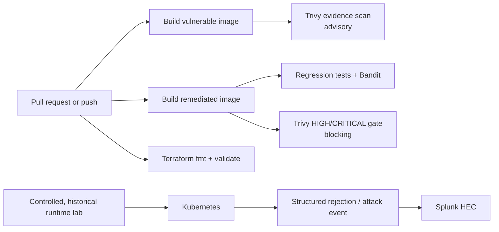
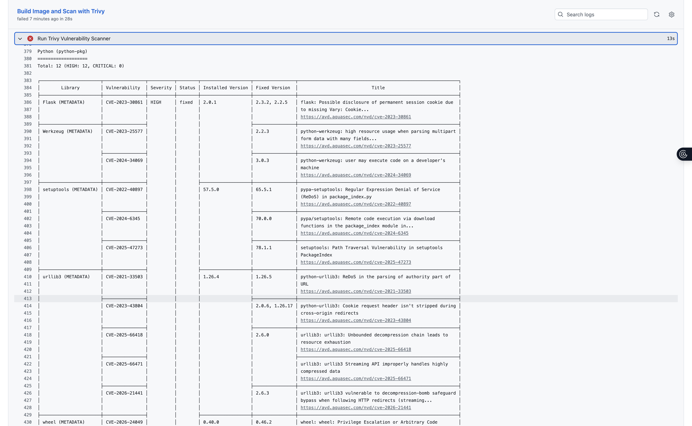
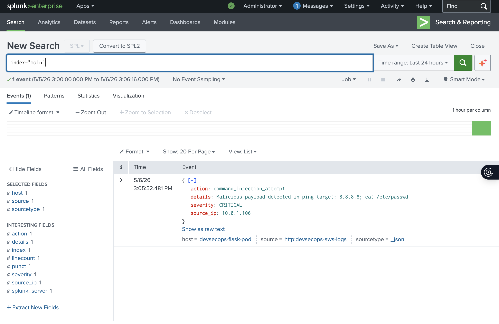

# AWS DevSecOps: Vulnerable Evidence vs. Remediated Gate

[](https://github.com/PeteAndrews1289/aws-devsecops-pipeline/actions/workflows/trivy-scan.yml)

> **Portfolio status:** completed and decommissioned lab. No AWS, Kubernetes, ngrok, or Splunk resources from the exercise are expected to be live.

This repository compares two deliberately different application targets:

- `app/backend/` is an **intentionally vulnerable evidence target**. It retains command injection, old dependencies, debug mode, and a root container so scanners and runtime detections have something meaningful to find.
- `app/remediated/` is a **reviewable remediation target**. It rejects shell payloads, avoids shell execution, validates request types and IP addresses, verifies TLS, runs as a non-root container user, and has regression tests.

CI reports findings from the vulnerable image without treating the expected findings as a release failure. The remediated application is the blocking path: tests, Bandit, repository hygiene checks, and HIGH/CRITICAL Trivy findings can fail the pull request.

## What this repository demonstrates



The GitHub Actions workflow validates and scans repository artifacts. It does **not** authenticate to AWS, push to ECR, apply Terraform, deploy to EKS, or prove that a live environment currently exists.

## Security comparison

| Control | Vulnerable evidence target | Remediated target |
|---|---|---|
| User input | Interpolated into a shell command | Requires a JSON object and a literal IPv4/IPv6 address |
| Command execution | `shell=True` by design | No shell or operating-system command execution |
| Dependencies | Deliberately obsolete | Fully pinned current dependency set |
| Runtime mode | Flask debug server | Gunicorn, debug disabled |
| Container identity | Root | Dedicated UID/GID 10001 |
| Telemetry transport | TLS verification enabled, but vulnerable app behavior remains | HTTPS-only HEC URL validation and normal certificate verification |
| CI policy | Advisory scanner evidence | Tests and security checks are blocking |

The detailed mapping is in [`docs/findings-comparison.md`](docs/findings-comparison.md).

## Evidence and limits

The historical lab produced three kinds of evidence:

1. Trivy identified OS and Python package vulnerabilities in the intentionally old image.
2. A controlled command-injection request reached the vulnerable endpoint.
3. Splunk received one structured `command_injection_attempt` event from that exercise.





The screenshots are point-in-time evidence, not a current benchmark. Scanner databases change, so the current Actions run is authoritative for current findings. Screenshots containing retired public endpoints, account-specific registry paths, or raw shell output were removed from the current branch; they remain recoverable in Git history.

See [`docs/evidence-summary.md`](docs/evidence-summary.md) for the evidence inventory and explicit limitations.

## Repository layout

```text
app/backend/                  intentionally vulnerable Flask target
app/remediated/               hardened comparison target and tests
k8s/base/                     remediated, private-by-default Kubernetes example
terraform/                    VPC, ECR, and EKS infrastructure example
scripts/validate_repository.py hygiene and configuration assertions
docs/                         findings, lifecycle notes, and historical evidence
.github/workflows/            pinned, least-privilege validation pipeline
```

## Run the remediated target locally

```bash
python -m venv .venv
source .venv/bin/activate
python -m pip install -r app/remediated/requirements-dev.txt
pytest -q app/remediated/tests
bandit -q -r app/remediated -x app/remediated/tests
python scripts/validate_repository.py
gunicorn --chdir app/remediated --bind 127.0.0.1:5000 app:app
```

Example validation request:

```bash
curl -sS -X POST http://127.0.0.1:5000/api/ping \
  -H 'Content-Type: application/json' \
  -d '{"target":"8.8.8.8"}'
```

An input such as `8.8.8.8; cat /etc/passwd` receives HTTP 400 and is never executed.

## Validate the infrastructure example

```bash
terraform -chdir=terraform fmt -check -recursive
terraform -chdir=terraform init -backend=false
terraform -chdir=terraform validate
```

The Terraform configuration requires an explicit `kubernetes_version` value before planning or applying so the repository does not silently recommend a stale EKS release. Its default posture uses private EKS API access, control-plane logs, immutable ECR tags, image scanning, and encrypted ECR storage.

The Kubernetes base is the remediated target, uses `ClusterIP`, drops Linux capabilities, disables privilege escalation, enables the default seccomp profile, and reads optional Splunk configuration from a ConfigMap and Secret. No HEC token or account-specific image registry is stored in Git.

## Safe lab use

Do not expose `app/backend/` to the internet or provide it real credentials. Use only isolated, disposable infrastructure and synthetic data. The vulnerable code is retained solely for scanner validation and controlled demonstrations.

Before provisioning anything, review [`docs/lab-lifecycle.md`](docs/lab-lifecycle.md), estimate AWS cost, choose a currently supported EKS version, and define a teardown checkpoint. The original exercise was dismantled after completion.

## Honest next steps

- Add a tested AWS OIDC role and ECR push stage before describing the workflow as deployment automation.
- Export sanitized Splunk searches/dashboards as code instead of relying on screenshots.
- Add a temporary integration environment that proves the remediated image can run under the Kubernetes security context.
- Produce a versioned scanner-results artifact if long-term finding trends are needed.
