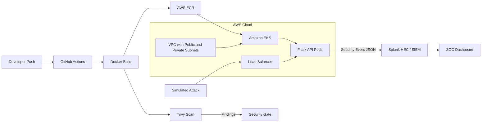

# AWS DevSecOps CI/CD Pipeline and Runtime SOC Lab

## Overview

This project demonstrates a hands-on DevSecOps lab that combines application security testing, container scanning, AWS infrastructure, Kubernetes deployment, and runtime security monitoring. It addresses a common security engineering problem: vulnerable application code should be caught before deployment, but runtime attacks still need to be logged, detected, and investigated after the application is exposed.

The lab uses an intentionally vulnerable Python/Flask API to generate realistic AppSec findings, including hardcoded secrets, outdated dependencies, debug exposure, and command injection. A GitHub Actions workflow builds the Docker image and uses Trivy as a security gate for high and critical findings. The cloud side uses Terraform, AWS ECR, EKS, VPC networking, Kubernetes manifests, and Splunk HEC-based runtime logging.

The repository is useful as a portfolio project because it connects "shift-left" security controls with "shield-right" runtime monitoring. It shows how vulnerable code can be scanned in CI/CD, deployed into a cloud environment for controlled testing, attacked, and monitored in Splunk.

## Key Features

- Built an intentionally vulnerable Flask API for DevSecOps testing.
- Added insecure patterns such as hardcoded demo secrets, vulnerable dependencies, debug mode, and command injection.
- Created a GitHub Actions workflow that builds a Docker image and scans it with Trivy.
- Configured Trivy to fail the build on high and critical vulnerability findings.
- Provisioned AWS infrastructure with Terraform, including VPC, ECR, and EKS resources.
- Deployed the Flask application to Kubernetes using deployment and service manifests.
- Routed runtime security events to Splunk through HTTP Event Collector.
- Simulated command injection against the `/api/ping` endpoint.
- Captured command injection attempts in Splunk for SOC-style monitoring.
- Included screenshots showing Trivy failures, Kubernetes deployment status, command injection, and Splunk logs.

## Architecture

The lab starts with source code in GitHub. GitHub Actions builds the backend container and scans it with Trivy. Terraform provisions AWS infrastructure, including a VPC, ECR, and EKS. Kubernetes runs the vulnerable Flask API, and simulated attacks against the API generate JSON security events that are sent to Splunk HEC.

## Tools & Technologies

### Cloud / Infrastructure

- AWS VPC
- Amazon EKS
- Amazon ECR
- Application Load Balancer
- Terraform
- Kubernetes

### Security Tools

- Trivy container and vulnerability scanning
- Splunk Enterprise
- Splunk HTTP Event Collector
- Command injection simulation

### Programming / Scripting

- Python
- Flask
- Docker
- YAML
- Terraform HCL

### Monitoring / Logging

- Runtime JSON security events
- Splunk HEC ingestion
- Splunk searches and dashboard screenshots

### Automation / CI/CD

- GitHub Actions
- Docker image build workflow
- Trivy scan gate for high and critical findings

## Security Concepts Demonstrated

This project demonstrates secure SDLC, DevSecOps, container security, vulnerability scanning, cloud infrastructure as code, Kubernetes deployment, runtime attack detection, and SIEM integration.

The CI/CD portion shows how automated scanning can catch vulnerable dependencies and secret-like values before deployment. The runtime portion shows that prevention is not enough: once an application is reachable, attempted exploitation should create structured telemetry that a SOC can search and investigate.

The lab also demonstrates the difference between intentionally vulnerable training code and production-ready deployment patterns. Some files intentionally contain insecure examples for scanner validation and attack simulation.

## Implementation Steps

1. Built a Python/Flask API with intentionally vulnerable behavior.
2. Added a `/api/ping` endpoint that demonstrates command injection risk.
3. Added JSON security logging for suspicious payloads.
4. Created a Dockerfile and containerized the application.
5. Added a GitHub Actions workflow to build and scan the Docker image.
6. Configured Trivy to fail on high and critical findings.
7. Created Terraform files for VPC, ECR, and EKS infrastructure.
8. Added Kubernetes manifests for application deployment and service exposure.
9. Configured runtime event forwarding to Splunk HEC.
10. Simulated a command injection payload against the live endpoint.
11. Verified detection of the payload in Splunk.
12. Captured screenshots of pipeline, cloud, runtime, and SIEM evidence.

## Results / Findings

The lab produced CI/CD evidence showing Trivy identifying vulnerable packages and causing the pipeline to fail securely. Screenshots also show Kubernetes deployment status, command injection testing, and Splunk receiving the security event generated by the vulnerable endpoint.

The main security finding is that vulnerable application behavior can be detected at multiple stages. CI/CD scanning identifies vulnerable dependencies and secret-like values before deployment, while runtime logging captures exploit attempts that occur after exposure.

The project also highlights areas that would need hardening before any production use, including replacing demo secrets with Kubernetes Secrets or a secret manager, disabling debug mode, validating command input safely, and using secure runtime configuration.

## Evidence / Artifacts

Existing evidence in this repository:

- `docs/screenshots/trivy-pipeline-failure.png`
- `docs/screenshots/trivy-python-cve.png`
- `docs/screenshots/trivy-debian-cve.png`
- `docs/screenshots/k8s-app-live-status.png`
- `docs/screenshots/k8-ctl.png`
- `docs/screenshots/command-injection.png`
- `docs/screenshots/splunk-command-injection-log.png`
- `docs/evidence-summary.md`
- `.github/workflows/devsecops.yml`
- `terraform/`
- `k8s/base/`
- `app/backend/`

## Challenges & Lessons Learned

- CI/CD scanning is most useful when it blocks high-risk findings instead of only reporting them.
- Runtime logging adds important visibility after an application is deployed.
- Intentionally vulnerable code should be clearly labeled and isolated from real production environments.
- Cloud deployment labs need strong secret hygiene, even when values are only used for demonstrations.
- Kubernetes and Splunk integration requires careful environment-variable and network configuration.

## Relevance to Security Roles

This project maps to DevSecOps Engineer, Application Security Engineer, Cloud Security Engineer, Detection Engineer, and SOC Analyst roles. It demonstrates secure pipeline design, vulnerability scanning, infrastructure as code, Kubernetes deployment, exploit simulation, and SIEM-based runtime monitoring.

It is especially useful for interviews because it connects application security findings with cloud deployment and runtime detection.

## Future Improvements

- Add a remediated version of the vulnerable Flask endpoint.
- Move demo secrets and Splunk HEC values into Kubernetes Secrets or AWS Secrets Manager.
- Add Semgrep or Bandit for source-code security scanning.
- Add Terraform security scanning with Checkov or tfsec.
- Add unit tests for input validation.
- Add exported Splunk dashboard configuration.
- Add a short findings report comparing vulnerable and remediated pipeline results.
- Add a cost and cleanup section for AWS resource teardown.
